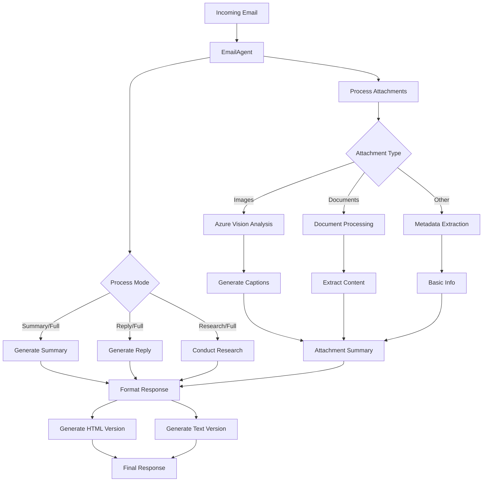

# MXTOAI Email Processing System

A robust email processing system that can handle, analyze, and respond to emails with advanced attachment processing capabilities.

## Features

- **Email Summarization**: Generate concise, structured summaries of email content including key points and action items.
- **Smart Reply Generation**: Create context-aware email replies based on the email's purpose and content.
- **Advanced Attachment Processing**: Analyze various types of attachments including:
  - **Documents**: PDF, DOCX, XLSX, PPTX, TXT, HTML
  - **Images**: JPG, PNG, GIF with Azure Vision-powered image captioning
  - **Media**: Various media file types with basic metadata extraction
- **Deep Research**: Optional integration with research APIs to provide deeper insights on email topics.
- **Multiple Processing Modes**: Process emails in different modes depending on your needs:
  - `summary`: Just generate a summary
  - `reply`: Just generate a reply
  - `research`: Perform research based on the email content
  - `full`: Complete processing (summary, reply, and research)
- **Rich Text Formatting**: Supports both HTML and plain text email responses with proper formatting
- **Attachment Analysis**: Provides detailed summaries of attachment contents in the email response
- **Error Resilience**: Graceful handling of processing errors with fallback responses

## Directory Structure

```
mxtoai/
├── agents/                 # Agent implementations for different tasks
│   └── email_agent.py     # Main email processing agent implementation
├── tools/                 # Individual tool implementations
│   ├── email_summary_tool.py      # Email summarization functionality
│   ├── attachment_processing_tool.py  # Attachment handling
│   └── deep_research_tool.py      # Research capabilities
├── scripts/              # Utility scripts and helpers
│   ├── visual_qa.py     # Azure Vision integration for images
│   └── report_formatter.py  # Email response formatting
├── email_processor/      # Core email processing logic
├── attachments/         # Temporary storage for attachments
├── models.py           # Data models and schemas
└── ai.py              # AI model configurations and utilities
```

## Email Processing Flow



## Setup and Installation

### Prerequisites

- Python 3.8+
- Azure OpenAI API access
- Azure Vision API access (for image processing)

### Installation

The project uses Poetry for dependency management. Here's how to set it up:

1. First, install Poetry if you haven't already:
```bash
# On macOS/Linux/WSL
curl -sSL https://install.python-poetry.org | python3 -

# On Windows (PowerShell)
(Invoke-WebRequest -Uri https://install.python-poetry.org -UseBasicParsing).Content | py -
```

2. Clone and set up the project:
```bash
# Clone the repository
git clone https://github.com/satwikkansal/mxtoai.git
cd mxtoai

# Install dependencies using Poetry
poetry install

# Activate the virtual environment
poetry shell
```

3. Verify the installation:
```bash
# Should show the version of mxtoai
poetry run python -c "import mxtoai; print(mxtoai.__version__)"
```

Poetry will automatically manage all dependencies and create a virtual environment for you. The `pyproject.toml` file contains all the project dependencies and metadata.

### Environment Variables

Copy the `.env.example` file to `.env` and update with your specific configuration:

```env
MODEL_ENDPOINT=your_azure_openai_endpoint
MODEL_API_KEY=your_azure_openai_api_key
MODEL_NAME=your-azure-openai-model-deployment
MODEL_API_VERSION=2025-01-01-preview

# Optional for research functionality
JINA_API_KEY=your-jina-api-key

# For image processing
AZURE_VISION_ENDPOINT=your-azure-vision-endpoint
AZURE_VISION_KEY=your-azure-vision-key
```

## API Endpoints

### Process Email

```
POST /process-email
```

#### JSON Request Example

Request body:

```json
{
  "subject": "Project Update - Q2 2023",
  "body": "Hi team,\n\nAttached is the Q2 project report. Please review and provide feedback.\n\nThanks,\nJohn",
  "sender": "john@example.com",
  "date": "2023-06-15T10:30:00",
  "processing_mode": "full",
  "attachments": [
    {
      "filename": "report.pdf",
      "type": "application/pdf",
      "path": "/path/to/temporary/file.pdf",
      "size": 1024
    }
  ]
}
```

#### Multipart Form Request Example

Here's how to send a request with file attachments using cURL:

```bash
curl --location 'http://localhost:8000/process-email' \
--form 'from_email="gautamprajapati06@gmail.com"' \
--form 'to="ai-assistant@mxtoai.com"' \
--form 'subject="Seeking Alpha newsletter"' \
--form 'textContent="Explain me what REITs are, be as detailed as possible"' \
--form 'date="2023-08-15T12:00:00Z"' \
--form 'files=@"/path/to/your/reit-article.pdf"' \
--form 'files=@"/path/to/your/business-card.jpg"'
```

> **Note**: Replace the file paths with actual paths to your files. The endpoint supports multiple file attachments.

#### Response Structure

```json
{
  "metadata": {
    "processed_at": "2024-03-25T10:30:25.123456",
    "mode": "full",
    "errors": [],
    "email_sent": {
      "status": "pending",
      "timestamp": "2024-03-25T10:30:25.123456"
    }
  },
  "email_content": {
    "html": "<formatted HTML content>",
    "text": "Plain text content",
    "enhanced": {
      "html": "<HTML with attachment summaries>",
      "text": "Text with attachment summaries"
    }
  },
  "attachments": {
    "summary": "Processed 1 attachment (1 document)",
    "processed": [
      {
        "filename": "report.pdf",
        "size": 1024,
        "type": "application/pdf",
        "content": {
          "text": "Extracted content summary..."
        }
      }
    ]
  }
}
```

### Using the EmailAgent Directly

```python
from mxtoai.agents.email_agent import EmailAgent
from dotenv import load_dotenv

# Load environment variables
load_dotenv()

# Initialize the agent
agent = EmailAgent(
    attachment_dir="./email_attachments",
    verbose=True,
    enable_deep_research=False  # Enable if needed
)

# Process an email
email_data = {
    "subject": "Project Update",
    "body": "Here's the latest project update...",
    "sender": "john@example.com",
    "attachments": [
        {
            "filename": "report.pdf",
            "type": "application/pdf",
            "path": "/path/to/file.pdf",
            "size": 1024
        }
    ]
}

# Process the email
results = agent.process_email(email_data, mode="full")

# Access the results
print(results["email_content"]["text"])  # Plain text version
print(results["email_content"]["html"])  # HTML version
print(results["attachments"]["summary"]) # Attachment processing summary
```

## Running the API Server

```bash
# Start the FastAPI server
uvicorn api:app --reload
```

## Advanced Features

### Attachment Processing

The system now supports:
- Automatic content extraction from documents
- Azure Vision-powered image analysis and captioning
- Fallback processing for unsupported file types
- Size-aware content summarization
- Error resilient processing

### Response Formatting

- Rich text formatting with markdown support
- Both HTML and plain text versions
- Automatic signature handling
- Attachment content integration
- Professional formatting with sections and highlights

### Error Handling

- Graceful degradation on processing failures
- Detailed error tracking and reporting
- Fallback responses for partial failures
- Comprehensive error logging

## License

MIT

## Contributing

Contributions are welcome! Please feel free to submit a Pull Request.
