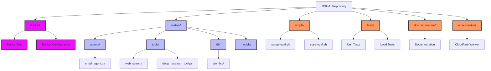

# 🤖 MXtoAI - Automate any email workflow with AI

> MXtoAI processes emails with advanced AI, handles attachments, and generates smart responses - all running on your own infrastructure.

[](https://www.docker.com/)
[](LICENSE)
[]()

## 🚀 Quick Start (5 minutes)

### Prerequisites
- [Docker Desktop](https://www.docker.com/products/docker-desktop) installed and running
- 4GB RAM available for Docker
- 10GB free disk space

### One-Command Setup

```bash
# Clone and start
git clone https://github.com/mxtoai/mxtoai-core.git
cd mxtoai

# Automated setup and start
./scripts/setup-local.sh && ./scripts/start-local.sh
```

**That's it!** 🎉

- **API Server**: http://localhost:8000
- **Health Check**: http://localhost:8000/health
- **API Documentation**: http://localhost:8000/docs
- **RabbitMQ Management**: http://localhost:15672 (guest/guest)

### Configure Your AI Model

Edit the `model.config.toml` file with your AI service credentials:

```toml
# For OpenAI
[[model]]
model_name = "gpt-4"
litellm_params.model = "gpt-4"
litellm_params.api_key = "your_openai_api_key_here"

# For Azure OpenAI
[[model]]
model_name = "azure-gpt-4"
litellm_params.model = "azure/gpt-4"
litellm_params.api_key = "your_azure_openai_api_key"
litellm_params.base_url = "https://your-resource.openai.azure.com/"
litellm_params.api_version = "2023-05-15"
```

For thinking models, make sure to set the model group name to "thinking".

## 🎯 What is MXtoAI?

MXtoAI is a powerful, self-hostable email processing system that acts as your intelligent email workflow assistant:

### ✨ **Core Features**

- **🧠 Smart Email Processing**: Automatically summarize, reply to, and analyze emails
- **📎 Advanced Attachment Handling**: Process PDFs, images, documents with AI-powered analysis
- **🔍 Deep Research**: Optional integration with research APIs for comprehensive insights
- **📧 Multiple Processing Modes**:
  - `summary@`: Generate email summaries
  - `reply@`: Create smart replies
  - `research@`: Perform topic research
  - `ask@`: Full processing with Q&A
- **⚡ Scalable Architecture**: Background processing with multiple workers
- **🔒 Privacy First**: Runs entirely on your infrastructure
- **🎨 Rich Formatting**: HTML and plain text responses with professional styling

## 📧 Process Your First Email

### Using the API

```bash
# Send an email for processing
curl -X POST "http://localhost:8000/process-email" \
  -H "Content-Type: application/json" \
  -d '{
    "from": "user@example.com",
    "to": "ask@yourdomain.com",
    "subject": "What is artificial intelligence?",
    "body": "Can you explain AI in simple terms?"
  }'
```

### Response Format

```json
{
  "message": "Email received and queued for processing",
  "email_id": "1743315736--3926735152910876943",
  "status": "processing"
}
```

The system processes emails asynchronously and can send responses via your configured email service.

## 🛠️ Configuration

### Environment Variables

MXtoAI uses a clean, organized environment configuration system:

#### 🚀 **Quick Setup**
1. **Copy the template**: `cp .env.example .env`
2. **Configure AI models**: Edit `model.config.toml` with your AI provider credentials
3. **Set security key**: Generate a secure `X_API_KEY`
4. **Configure email service**: Add AWS SES credentials for sending responses

#### 📝 **Configuration Files**
- **`.env`** - Environment variables (copy from `.env.example`)
- **`model.config.toml`** - AI model configurations (copy from `model.config.example.toml`)

#### ⚡ **Essential Variables**

```bash
# Security (Required)
X_API_KEY=your_secure_random_key_here

# AI Models (Required)
LITELLM_DEFAULT_MODEL_GROUP=gpt-4

# Email Service (Required for sending responses)
AWS_REGION=us-east-1
AWS_ACCESS_KEY_ID=your_aws_access_key
AWS_SECRET_ACCESS_KEY=your_aws_secret_key
SENDER_EMAIL=assistant@yourdomain.com

# Docker uses built-in defaults for databases and queues
```

#### 🔗 **Optional Services**
Enable additional functionality by adding API keys:
- **Search**: `SERPAPI_API_KEY`, `SERPER_API_KEY`, `BRAVE_SEARCH_API_KEY`
- **Research**: `JINA_API_KEY` for deep research features

📚 **Full Documentation**: See [Environment Variables Reference](ENV_VARIABLES.md) for complete configuration options.

### Advanced Configuration

For production deployments and advanced features, see:
- [📚 Docker Setup Guide](DOCKER_SETUP.md) - Complete deployment guide
- [🔧 Development Setup](#development-setup) - Local development with Poetry
- [🌐 Production Deployment](#production-deployment) - Production configuration

## 🔄 Managing the System

### Docker Commands

```bash
# Check status
docker compose ps

# View logs
docker compose logs api_server
docker compose logs worker

# Restart services
docker compose restart

# Stop everything
docker compose down

# Clean reset (removes data)
docker compose down -v
```

### Health Monitoring

- **API Health**: `curl http://localhost:8000/health`
- **Service Status**: `docker compose ps`
- **Resource Usage**: Docker Desktop Dashboard

## 🚀 Production Deployment

### Quick Production Setup

1. **Use external databases** (recommended):
```bash
# In production .env
DB_HOST=your.postgresql.host
REDIS_HOST=your.redis.host
```

2. **Configure HTTPS** with reverse proxy (nginx/Traefik)

3. **Set resource limits**:
```yaml
# docker-compose.prod.yml
services:
  api_server:
    deploy:
      resources:
        limits:
          memory: 2G
          cpus: '1.0'
```

4. **Scale workers for load**:
```bash
docker compose up --scale worker=3
```

See [DOCKER_SETUP.md](DOCKER_SETUP.md) for complete production guidance.

## 🔧 Development Setup

For contributors who want to develop using Poetry instead of Docker:

### Prerequisites
- Python 3.12+
- Poetry
- PostgreSQL
- Redis
- RabbitMQ

### Local Development Setup

```bash
# Install dependencies
poetry install
poetry shell

# Setup services (macOS example)
brew services start postgresql@16
brew services start redis
brew services start rabbitmq

# Configure environment
cp .env.example .env
# Edit .env with local service settings

# Run database migrations
cd mxtoai/db
poetry run alembic upgrade head
cd ../..

# Start services (3 separate terminals)
poetry run python run_api.py                           # API Server
poetry run dramatiq mxtoai.tasks --watch ./            # Worker
poetry run python -m mxtoai.scheduler_runner          # Scheduler
```

## 📁 Repository Structure



### 🗂️ Key Directories

| Directory | Purpose | Key Files |
|-----------|---------|-----------|
| `🐳 docker/` | Container configurations | Dockerfiles, init scripts |
| `🤖 mxtoai/` | Core application code | agents, tools, database models |
| `📋 scripts/` | Setup & deployment | setup-local.sh, start-local.sh |
| `🧪 tests/` | Test suite | Unit tests, load tests |
| `📖 docusaurus-site/` | Documentation website | Docs, guides, examples |
| `📧 email-worker/` | Cloudflare worker | Alternative email processor |
| `🔧 Root configs` | Project configuration | Docker, environment, dependencies |

## 🔧 Advanced Features

### Attachment Processing Capabilities

- **📄 Documents**: PDF, DOCX, XLSX, PPTX, TXT, HTML
- **🖼️ Images**: JPG, PNG, GIF with AI-powered captioning
- **📊 Spreadsheets**: Automatic data analysis and summarization
- **🎥 Media**: Basic metadata extraction

### Multiple AI Model Support

MXtoAI supports load balancing across multiple AI providers:

- OpenAI GPT models
- Azure OpenAI
- AWS Bedrock (Claude)
- Local models via Ollama
- Custom API endpoints

### Scheduled Tasks

Create recurring email processing tasks:

```bash
# Send daily reports
curl -X POST "http://localhost:8000/schedule-task" \
  -d '{"cron": "0 9 * * *", "task": "daily_summary"}'
```

## 🧪 Testing

### Unit Tests

```bash
# Run test suite
docker exec -it worker pytest
```

## 🆘 Troubleshooting

### Common Issues

**"Port already in use"**
```bash
# Find what's using the port
lsof -i :8000
# Change port in .env
API_PORT=8080
```

**"Out of memory"**
- Increase Docker Desktop memory allocation to 6GB+
- Close other applications

**"Service unhealthy"**
```bash
# Check service logs
docker compose logs [service_name]

# Restart specific service
docker compose restart [service_name]
```

For more troubleshooting, see [DOCKER_SETUP.md](DOCKER_SETUP.md#troubleshooting).

## 🤝 Contributing

We welcome contributions! Here's how to get started:

1. **Fork** the repository
2. **Setup** development environment: `./scripts/setup-local.sh`
3. **Make** your changes
4. **Test** thoroughly
5. **Submit** a Pull Request

See [CONTRIBUTING.md](CONTRIBUTING.md) for detailed guidelines.

## 📄 License

This project is licensed under the MIT License - see the [LICENSE](LICENSE) file for details.

## 🌟 Support

- **📖 Documentation**: [DOCKER_SETUP.md](DOCKER_SETUP.md)
- **🐛 Issues**: [GitHub Issues](https://github.com/your-org/mxtoai/issues)
- **💬 Discussions**: [GitHub Discussions](https://github.com/your-org/mxtoai/discussions)

---

<div align="center">

**⭐ Star this repo if MXtoAI helps you!**

Made with ❤️ for the open source community

</div>
